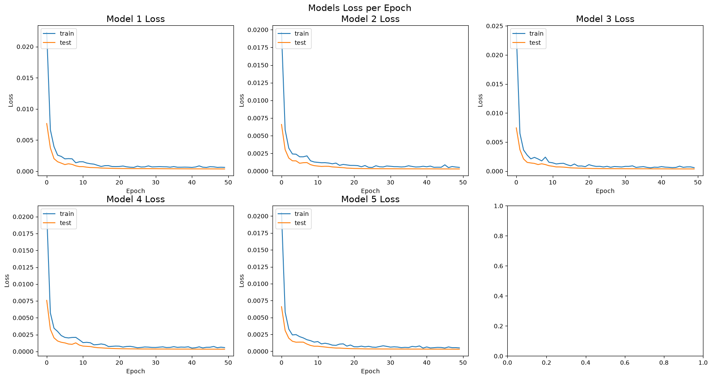
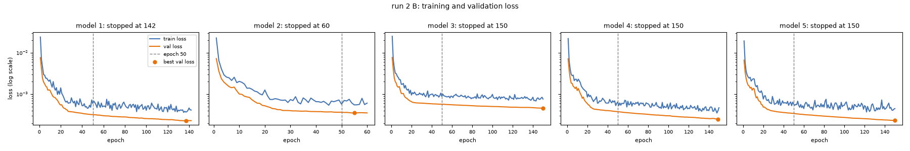
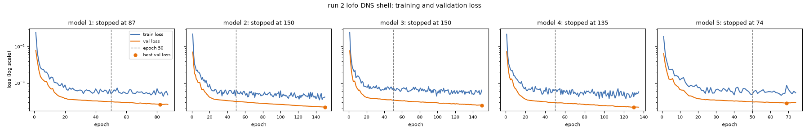
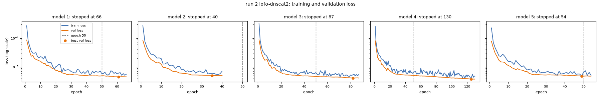
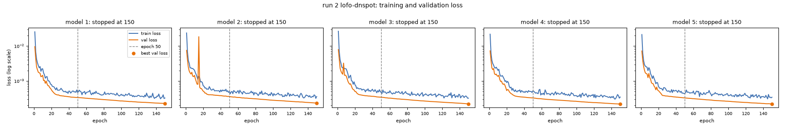
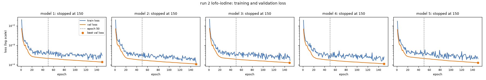
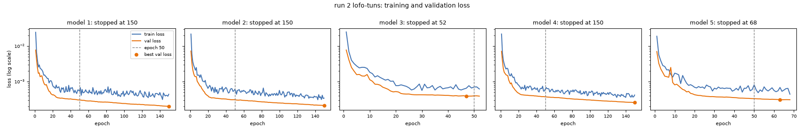

# Zeek BiLSTM run

Generated by `notebooks/dns_tunneling_bilstm_model.ipynb` on 2026-09-17T23:38:07+00:00 (started 2026-09-17T17:27:34+00:00).

- Git commit: `baf6543e643c88164dc2bf4f33fc5741da529ca0`
- Versions: python 3.13.15, tensorflow 2.21.0, keras 3.15.1, numpy 2.5.3, pandas 3.0.5, scikit-learn 1.9.1
- Platform: Windows-11-10.0.26200-SP0

## How to reproduce

```text
python Ardashes_scripts/process_pcaps.py        # Zeek logs + manifest
python Ardashes_scripts/reorder_and_rezeek.py   # time-sort out-of-order pcaps, re-run Zeek
python notebooks/dataset_splits.py              # splits.csv (committed; only if the data changed)
# then run notebooks/dns_tunneling_bilstm_model.ipynb top to bottom
```

## Settings

| setting | value |
|---|---|
| window_seconds | `60` |
| rejoin_max_gap_seconds | `30` |
| train/val row caps per (capture, window) | `{'default': 200, 'wildcard': 1000}` |
| sampling_seed | `0` |
| model seed | `0` |
| runs per configuration | `5` |
| hyperparameters | `{'n_of_hidden_layers': 1, 'n_neurons': 24, 'activation': 'tanh', 'dropout_rate': 0.5, 'l2_reg': 0.0001, 'epochs': 50, 'batch_size': 128, 'early_stopping': True}` |
| class weights | `sklearn 'balanced', computed in Build_model` |
| decision rule | `argmax of the softmax output` |
| splits.csv sha256 | `0ad16bd5e36bf0a4108bbd541f4005897b8111927c73422af9cbea4f9bfe1282` |
| models saved to | `models/zeek_bilstm/<name>/ (gitignored)` |

## Data per split

Rows are DNS records. Train and val rows are sampled per (capture, window) with the row caps above; test and held-out rows are scored in full. Windows are 60 s.

**Config A** (stress test: no wildcard in training, all wildcard held out)

| split | role | class | category | rows | windows | captures | sampled rows |
|---|---|---|---|---|---|---|---|
| train | fit | benign | normal | 720,000 | 573 | 48 | 110,904 |
| train | fit | tunnel | tunnel | 140,462 | 661 | 13 | 106,680 |
| val | model_selection | benign | normal | 105,000 | 61 | 7 | 12,016 |
| val | model_selection | tunnel | tunnel | 26,997 | 143 | 13 | 22,621 |
| test | in_distribution_test | benign | normal | 105,000 | 67 | 7 |  |
| test | in_distribution_test | tunnel | tunnel | 17,461 | 144 | 13 |  |
| heldout | fpr_normal | benign | normal | 76,247 | 53 | 6 |  |
| heldout | fpr_wildcard | benign | wildcard | 373,570 | 73 | 13 |  |
| heldout | unseen_platform | tunnel | crossEndPoint | 66,345 | 387 | 5 |  |
| heldout | unseen_tool | tunnel | unknownTunnel | 278,255 | 808 | 6 |  |

**Config B** (primary: wildcard hard negatives in training)

| split | role | class | category | rows | windows | captures | sampled rows |
|---|---|---|---|---|---|---|---|
| train | fit | benign | normal | 720,000 | 573 | 48 | 110,904 |
| train | fit | benign | wildcard | 184,780 | 22 | 6 | 21,610 |
| train | fit | tunnel | tunnel | 140,462 | 661 | 13 | 106,680 |
| val | model_selection | benign | normal | 105,000 | 61 | 7 | 12,016 |
| val | model_selection | benign | wildcard | 26,247 | 7 | 1 | 6,216 |
| val | model_selection | tunnel | tunnel | 26,997 | 143 | 13 | 22,621 |
| test | in_distribution_test | benign | normal | 105,000 | 67 | 7 |  |
| test | in_distribution_test | tunnel | tunnel | 17,461 | 144 | 13 |  |
| heldout | fpr_normal | benign | normal | 76,247 | 53 | 6 |  |
| heldout | fpr_wildcard | benign | wildcard | 162,543 | 44 | 6 |  |
| heldout | unseen_platform | tunnel | crossEndPoint | 66,345 | 387 | 5 |  |
| heldout | unseen_tool | tunnel | unknownTunnel | 278,255 | 808 | 6 |  |

## Configs B (primary) and A (stress test)

Each cell is the average over the runs, with min – max in brackets. Rates are the share of rows classified as tunnel: false positive rates for benign rows, recall for tunnel rows.

| metric | config B | config A |
|---|---|---|
| In-distribution test accuracy | 99.99% (99.99% – 99.99%) | 99.99% (99.99% – 99.99%) |
| In-distribution test FPR (normal 00055–00061) | 0.00% (0.00% – 0.00%) | 0.00% (0.00% – 0.00%) |
| In-distribution test recall (tunnel test segments) | 99.95% (99.95% – 99.95%) | 99.95% (99.95% – 99.95%) |
| FPR held-out normal | 0.01% (0.00% – 0.01%) | 0.01% (0.01% – 0.01%) |
| FPR held-out wildcard 00007–00012 | 0.00% (0.00% – 0.00%) | 14.16% (2.13% – 28.89%) |
| FPR held-out wildcard (all held-out captures) | 0.00% (0.00% – 0.00%) | 20.68% (7.19% – 38.13%) |
| Recall unseen tools (unknownTunnel) | 97.09% (97.07% – 97.13%) | 97.10% (97.07% – 97.21%) |
| Recall unseen platform (crossEndPoint, iodine on Android) | 99.39% (99.34% – 99.49%) | 99.38% (99.29% – 99.42%) |
| Collapsed runs (one class on the whole test set) | 0/5 | 0/5 |
| Epochs trained (min–max) | 50–50 | 50–50 |
| Training rows (benign / tunnel) | 132,514 / 106,680 | 110,904 / 106,680 |

In config A all 13 wildcard captures are held out; in config B only 00007–00012. The 00007–00012 row compares the two on the same captures.

## Recall per unseen tool (unknownTunnel)

| unseen tool | config B | config A |
|---|---|---|
| cobalstrike | 92.45% (92.33% – 92.69%) | 92.82% (92.31% – 94.79%) |
| dns2tcp-key | 99.98% (99.98% – 99.98%) | 99.98% (99.98% – 100.00%) |
| dns2tcp-txt | 100.00% (99.98% – 100.00%) | 100.00% (100.00% – 100.00%) |
| ozymandns | 19.91% (19.62% – 20.88%) | 19.62% (19.62% – 19.62%) |
| tcp-over-dns-CNAME | 100.00% (100.00% – 100.00%) | 100.00% (100.00% – 100.00%) |
| tcp-over-dns-TXT | 100.00% (100.00% – 100.00%) | 100.00% (100.00% – 100.00%) |

## Recall per unseen-platform capture (crossEndPoint: iodine on Android)

| unseen platform | config B | config A |
|---|---|---|
| AndIodine-CNAME | 99.64% (99.64% – 99.64%) | 99.64% (99.64% – 99.64%) |
| AndIodine-MX | 99.68% (99.65% – 99.76%) | 99.51% (99.49% – 99.52%) |
| AndIodine-NULL | 98.86% (98.86% – 98.86%) | 98.86% (98.86% – 98.86%) |
| AndIodine-SRV | 99.11% (98.88% – 99.47%) | 99.22% (98.82% – 99.43%) |
| AndIodine-TXT | 99.30% (99.30% – 99.30%) | 99.30% (99.30% – 99.30%) |

## By window size

Average rate over the runs, split by the number of queries in the row's 60 s window (all domains). Rows = rows in the bucket.

**Config B**

| group | <10 | 10-99 | >=100 |
|---|---|---|---|
| In-distribution test FPR (normal 00055–00061) | 0.00% (1) | 0.00% (88) | 0.00% (104,911) |
| In-distribution test recall (tunnel test segments) | 63.64% (22) | 100.00% (1,275) | 100.00% (16,164) |
| FPR held-out normal | 0.00% (2) | 0.00% (129) | 0.01% (76,116) |
| FPR held-out wildcard (all held-out captures) | – | 0.00% (143) | 0.00% (162,400) |
| FPR held-out wildcard 00007–00012 | – | 0.00% (143) | 0.00% (162,400) |
| Recall unseen tools (unknownTunnel) | 27.52% (141) | 88.84% (4,130) | 97.25% (273,984) |
| Recall unseen platform (crossEndPoint, iodine on Android) | 48.75% (16) | 94.91% (5,781) | 99.83% (60,548) |

**Config A**

| group | <10 | 10-99 | >=100 |
|---|---|---|---|
| In-distribution test FPR (normal 00055–00061) | 0.00% (1) | 0.00% (88) | 0.00% (104,911) |
| In-distribution test recall (tunnel test segments) | 63.64% (22) | 100.00% (1,275) | 100.00% (16,164) |
| FPR held-out normal | 0.00% (2) | 0.00% (129) | 0.01% (76,116) |
| FPR held-out wildcard (all held-out captures) | – | 0.00% (143) | 20.69% (373,427) |
| FPR held-out wildcard 00007–00012 | – | 0.00% (143) | 14.18% (162,400) |
| Recall unseen tools (unknownTunnel) | 24.11% (141) | 88.56% (4,130) | 97.27% (273,984) |
| Recall unseen platform (crossEndPoint, iodine on Android) | 50.00% (16) | 94.72% (5,781) | 99.83% (60,548) |

## Feature-set ablations (config B)

Same rows, splits and training setup; only the model's input columns change.

| feature set | In-distribution test accuracy | FPR held-out normal | FPR held-out wildcard (all held-out captures) | Recall unseen tools (unknownTunnel) | Recall unseen platform (crossEndPoint, iodine on Android) |
|---|---|---|---|---|---|
| `all` (43 inputs) | 99.99% (99.99% – 99.99%) | 0.01% (0.00% – 0.01%) | 0.00% (0.00% – 0.00%) | 97.09% (97.07% – 97.13%) | 99.39% (99.34% – 99.49%) |
| `lexical_only` (24 inputs) | 99.91% (99.90% – 99.93%) | 0.01% (0.01% – 0.02%) | 0.51% (0.46% – 0.56%) | 99.81% (99.80% – 99.82%) | 99.63% (99.60% – 99.64%) |
| `domain_volume_shape` (11 inputs) | 99.93% (99.93% – 99.94%) | 0.02% (0.02% – 0.02%) | 0.00% (0.00% – 0.00%) | 92.44% (92.16% – 93.05%) | 99.43% (99.29% – 99.61%) |
| `all_minus_artefact_suspect` (41 inputs) | 99.99% (99.99% – 99.99%) | 0.00% (0.00% – 0.00%) | 0.00% (0.00% – 0.00%) | 99.18% (99.11% – 99.22%) | 99.60% (99.49% – 99.62%) |

- `all`: proto, qname_len, label_count, max_label_len, avg_label_len, first_label_len, digit_ratio, hex_ratio, unique_char_ratio, entropy, first_label_entropy, qtype_name, response_ancount, response_min_ttl, response_rcode, domain_query_count, domain_unique_qnames, domain_query_rate, domain_duration, domain_unique_subdomain_ratio, domain_avg_qname_len, domain_std_qname_len, domain_avg_entropy, domain_txt_ratio, domain_null_ratio, domain_qtype_diversity, nxdomain_ratio, no_response_ratio, rejected_ratio, rcode_entropy
- `lexical_only`: qname_len, label_count, max_label_len, avg_label_len, first_label_len, digit_ratio, hex_ratio, unique_char_ratio, entropy, first_label_entropy, qtype_name
- `domain_volume_shape`: domain_query_count, domain_unique_qnames, domain_query_rate, domain_duration, domain_unique_subdomain_ratio, domain_avg_qname_len, domain_std_qname_len, domain_avg_entropy, domain_txt_ratio, domain_null_ratio, domain_qtype_diversity
- `all_minus_artefact_suspect`: proto, qname_len, label_count, max_label_len, avg_label_len, first_label_len, digit_ratio, hex_ratio, unique_char_ratio, entropy, first_label_entropy, qtype_name, response_ancount, response_min_ttl, response_rcode, domain_query_count, domain_unique_qnames, domain_query_rate, domain_duration, domain_unique_subdomain_ratio, domain_avg_qname_len, domain_std_qname_len, domain_avg_entropy, domain_txt_ratio, domain_null_ratio, nxdomain_ratio, rejected_ratio, rcode_entropy

## Leave-one-tunnel-family-out cross-validation

Config B benign data. Each fold trains on the train segments of four tunnel families (val on their val segments) and is scored on every row of the fifth family's captures plus the held-out normal and wildcard captures.

| held-out family | rows | recall | FPR held-out normal | FPR held-out wildcard | collapsed |
|---|---|---|---|---|---|
| DNS-shell | 21,855 | 6.47% (0.11% – 20.49%) | 0.00% (0.00% – 0.00%) | 0.01% (0.00% – 0.01%) | 0/5 |
| dnscat2 | 64,438 | 99.95% (99.92% – 99.99%) | 0.00% (0.00% – 0.00%) | 0.00% (0.00% – 0.00%) | 0/5 |
| dnspot | 26,687 | 4.10% (1.32% – 14.94%) | 0.00% (0.00% – 0.00%) | 0.00% (0.00% – 0.00%) | 0/5 |
| iodine | 58,970 | 58.23% (56.83% – 59.60%) | 0.00% (0.00% – 0.00%) | 0.30% (0.30% – 0.31%) | 0/5 |
| tuns | 18,525 | 99.97% (99.97% – 99.97%) | 0.01% (0.01% – 0.01%) | 0.01% (0.00% – 0.02%) | 0/5 |

| family | capture | recall |
|---|---|---|
| DNS-shell | DNS-shell | 6.47% (0.11% – 20.49%) |
| dnscat2 | dnscat2-cname | 100.00% (100.00% – 100.00%) |
| dnscat2 | dnscat2-mx | 99.89% (99.79% – 99.98%) |
| dnscat2 | dnscat2-txt | 100.00% (100.00% – 100.00%) |
| dnspot | dnspot | 4.10% (1.32% – 14.94%) |
| iodine | iodine-NULL | 82.87% (81.68% – 84.77%) |
| iodine | iodine-a | 0.23% (0.19% – 0.33%) |
| iodine | iodine-cname | 99.98% (99.98% – 99.98%) |
| iodine | iodine-mx | 78.85% (72.23% – 84.22%) |
| iodine | iodine-private | 88.30% (86.88% – 90.57%) |
| iodine | iodine-srv | 1.07% (0.68% – 1.69%) |
| iodine | iodine-txt | 99.83% (99.76% – 99.91%) |
| tuns | tuns | 99.97% (99.97% – 99.97%) |

## Comparison with the PCAP-based model

| PCAP-based notebook (README) | value |
|---|---|
| held-out accuracy | 99.8% |
| false positive rate (wildcard) | 0% |
| recall on unseen tools | 99.3-100% |
| held-out set | cobalstrike, ozymandns, AndIodine-TXT, wildcard_00000 (dnspot and two wildcard captures were in training) |

The Zeek-based numbers above use a different, larger evaluation: 6 held-out normal chunks, 6 or 13 held-out wildcard captures, all 6 unknownTunnel tools and all 5 crossEndPoint captures, with every tool's in-distribution test data taken from a later part of its own capture.

- Seeds are fixed (sampling and model), but TensorFlow on CPU is not guaranteed bit-for-bit reproducible, so reruns can differ slightly.
- crossEndPoint is iodine running on Android: an unseen platform, not an unseen tool.
- The benign 'normal' captures are a scripted crawl of the Cloudflare top-1M list; see the Step 1 feature sanity check and the ablations for how much the model relies on features that crawl makes easy.

<!-- section:run2_default_150ep:start -->
## Run 2: default features without the artefact-suspect pair, epoch cap 150

Two changes from run 1, and a targeted re-run (config B and the leave-one-family-out folds; config A, the ablations and the final model are not retrained yet):

1. **Default feature set: `all_minus_artefact_suspect`** (28 features; `domain_qtype_diversity` and `no_response_ratio` left out). In run 1's config B ablation, dropping them raised recall on unseen tools from 97.09% (97.07–97.13) to 99.18% (99.11–99.22) and on the unseen platform from 99.39% to 99.60%, with false positive rates on held-out normal 0.01% → 0.00% and held-out wildcard 0.00% → 0.00%. Both features are still computed and form part of the `all` feature set.
2. **Epoch cap 50 → 150**, early-stopping patience and everything else in `Build_model` unchanged: 40 of the 50 run-1 models hit the cap, including all 10 config A and B models (early stopping fired only in some ablation and dnscat2-fold models). Run 1's config B loss curves, from its notebook output: 

Each configuration now reseeds (seed 0) before training. For config B the run-1 ablation column (same 28 features, 50 epochs) isolates the effect of the longer training; the leave-one-family-out comparison changes both at once. The run-1 columns were re-scored from the saved run-1 models and match the tables above.

- Run `run2_default_150ep`: configurations `B`, `lofo-DNS-shell`, `lofo-dnscat2`, `lofo-dnspot`, `lofo-iodine`, `lofo-tuns`; trained 2026-09-18T05:58:27+00:00 – 2026-09-18T08:22:42+00:00.
- Git commit: `36479a120a39aee68aeb2284007460e715ec2a5b`
- Versions: python 3.13.15, tensorflow 2.21.0, keras 3.15.1, numpy 2.5.3, pandas 3.0.5, scikit-learn 1.9.1
- Models: `models/zeek_bilstm/run2_default_150ep/<name>/`; per-configuration results: `results/runs/run2_default_150ep/<name>.json`.
- Reference columns (run 1): re-scored from the saved models in `models/zeek_bilstm/<name>/`.

### Settings

| setting | run 1 | run 2 |
|---|---|---|
| epoch_cap | `50` | `150` |
| row_caps | `{'default': 200, 'wildcard': 1000}` | `{'default': 200, 'wildcard': 1000}` |
| sampling_seed | `0` | `0` |
| window_seconds | `60` | `60` |
| splits_sha256 | `0ad16bd5e36bf0a4108bbd541f4005897b8111927c73422af9cbea4f9bfe1282` | `0ad16bd5e36bf0a4108bbd541f4005897b8111927c73422af9cbea4f9bfe1282` |
| feature set | `all` | `all_minus_artefact_suspect` (28 features) |

### Training length

Epoch cap 150 (early stopping on val loss, patience 5, best weights restored; learning rate halved after 2 epochs without improvement). `stopped` is the last epoch trained, `best` the epoch with the lowest val loss (the weights kept). The `best vs epoch 50` column is the relative change in val loss from epoch 50 to the best epoch.

| configuration | stopped | best | early-stopped | val loss @ 50 | best val loss | best vs epoch 50 | final LR | run 1 epochs |
|---|---|---|---|---|---|---|---|---|
| `B` | 142, 60, 150, 150, 150 | 137, 55, 150, 149, 150 | 2/5 | 3.20e-04, 3.67e-04, 5.72e-04, 3.77e-04, 3.43e-04 | 2.27e-04, 3.51e-04, 4.59e-04, 2.50e-04, 2.31e-04 | -29%, -4%, -20%, -34%, -33% | 1e-05, 1e-05, 1e-05, 1e-05, 1e-05 | 50, 50, 50, 50, 50 |
| `lofo-DNS-shell` | 87, 150, 150, 135, 74 | 82, 150, 150, 130, 69 | 3/5 | 3.06e-04, 3.14e-04, 3.38e-04, 2.93e-04, 3.05e-04 | 2.59e-04, 2.20e-04, 2.42e-04, 2.18e-04, 2.83e-04 | -15%, -30%, -29%, -26%, -7% | 1e-05, 1e-05, 1e-05, 1e-05, 1e-05 | 50, 50, 50, 50, 50 |
| `lofo-dnscat2` | 66, 40, 87, 130, 54 | 61, 35, 82, 125, 49 | 5/5 | 4.94e-04, n/a, 4.66e-04, 5.06e-04, 4.79e-04 | 4.49e-04, 5.02e-04, 4.09e-04, 3.76e-04, 4.75e-04 | -9%, n/a, -12%, -26%, -1% | 1e-05, 1e-05, 1e-05, 1e-05, 1e-05 | 29, 30, 50, 50, 28 |
| `lofo-dnspot` | 150, 150, 150, 150, 150 | 150, 150, 150, 150, 150 | 0/5 | 3.38e-04, 3.60e-04, 3.46e-04, 3.29e-04, 3.29e-04 | 2.29e-04, 2.35e-04, 2.23e-04, 2.21e-04, 2.22e-04 | -32%, -35%, -35%, -33%, -33% | 1e-05, 1e-05, 1e-05, 1e-05, 1e-05 | 50, 50, 50, 50, 50 |
| `lofo-iodine` | 150, 150, 150, 150, 150 | 150, 150, 149, 150, 150 | 0/5 | 2.13e-04, 1.72e-04, 1.92e-04, 1.73e-04, 2.11e-04 | 1.38e-04, 1.09e-04, 1.27e-04, 1.12e-04, 1.27e-04 | -35%, -37%, -34%, -35%, -40% | 1e-05, 1e-05, 1e-05, 1e-05, 1e-05 | 50, 50, 50, 50, 50 |
| `lofo-tuns` | 150, 150, 52, 150, 68 | 150, 150, 47, 150, 63 | 2/5 | 3.03e-04, 3.07e-04, 3.96e-04, 3.72e-04, 3.32e-04 | 2.00e-04, 2.12e-04, 3.87e-04, 2.56e-04, 3.08e-04 | -34%, -31%, -2%, -31%, -7% | 1e-05, 1e-05, 1e-05, 1e-05, 1e-05 | 50, 50, 50, 50, 50 |













### Config B

Average over the runs, min – max in brackets. Rates are the share of rows classified as tunnel.

| metric | run 1 B | run 1 B-all_minus_artefact_suspect | run 2 B |
|---|---|---|---|
| In-distribution test accuracy | 99.99% (99.99% – 99.99%) | 99.99% (99.99% – 99.99%) | 99.99% (99.99% – 99.99%) |
| In-distribution test FPR (normal 00055–00061) | 0.00% (0.00% – 0.00%) | 0.00% (0.00% – 0.00%) | 0.00% (0.00% – 0.00%) |
| In-distribution test recall (tunnel test segments) | 99.95% (99.95% – 99.95%) | 99.95% (99.95% – 99.95%) | 99.95% (99.94% – 99.95%) |
| FPR held-out normal | 0.01% (0.00% – 0.01%) | 0.00% (0.00% – 0.00%) | 0.00% (0.00% – 0.00%) |
| FPR held-out wildcard 00007–00012 | 0.00% (0.00% – 0.00%) | 0.00% (0.00% – 0.00%) | 0.00% (0.00% – 0.00%) |
| FPR held-out wildcard (all held-out captures) | 0.00% (0.00% – 0.00%) | 0.00% (0.00% – 0.00%) | 0.00% (0.00% – 0.00%) |
| Recall unseen tools (unknownTunnel) | 97.09% (97.07% – 97.13%) | 99.18% (99.11% – 99.22%) | 99.11% (98.90% – 99.55%) |
| Recall unseen platform (crossEndPoint, iodine on Android) | 99.39% (99.34% – 99.49%) | 99.60% (99.49% – 99.62%) | 99.62% (99.58% – 99.62%) |
| Collapsed runs | 0/5 | 0/5 | 0/5 |
| Epochs trained | 50, 50, 50, 50, 50 | 50, 50, 50, 50, 50 | 142, 60, 150, 150, 150 |

**Recall per unseen tool, config B**

| capture | run 1 B | run 1 B-all_minus_artefact_suspect | run 2 B |
|---|---|---|---|
| cobalstrike | 92.45% (92.33% – 92.69%) | 88.13% (88.07% – 88.19%) | 89.26% (87.88% – 94.48%) |
| dns2tcp-key | 99.98% (99.98% – 99.98%) | 99.67% (99.10% – 99.98%) | 98.61% (97.53% – 99.86%) |
| dns2tcp-txt | 100.00% (99.98% – 100.00%) | 97.36% (97.36% – 97.36%) | 97.36% (97.36% – 97.36%) |
| ozymandns | 19.91% (19.62% – 20.88%) | 100.00% (100.00% – 100.00%) | 100.00% (100.00% – 100.00%) |
| tcp-over-dns-CNAME | 100.00% (100.00% – 100.00%) | 100.00% (100.00% – 100.00%) | 100.00% (99.99% – 100.00%) |
| tcp-over-dns-TXT | 100.00% (100.00% – 100.00%) | 100.00% (100.00% – 100.00%) | 100.00% (100.00% – 100.00%) |

**Recall per unseen-platform capture (iodine on Android), config B**

| capture | run 1 B | run 1 B-all_minus_artefact_suspect | run 2 B |
|---|---|---|---|
| AndIodine-CNAME | 99.64% (99.64% – 99.64%) | 99.80% (99.80% – 99.80%) | 99.80% (99.80% – 99.80%) |
| AndIodine-MX | 99.68% (99.65% – 99.76%) | 99.84% (99.84% – 99.84%) | 99.82% (99.72% – 99.84%) |
| AndIodine-NULL | 98.86% (98.86% – 98.86%) | 98.86% (98.86% – 98.86%) | 98.86% (98.86% – 98.86%) |
| AndIodine-SRV | 99.11% (98.88% – 99.47%) | 99.66% (99.17% – 99.78%) | 99.77% (99.72% – 99.78%) |
| AndIodine-TXT | 99.30% (99.30% – 99.30%) | 99.30% (99.30% – 99.30%) | 99.30% (99.30% – 99.30%) |

**By window size, config B**: average rate per bucket of queries in the row's 60 s window (empty buckets left out).

| group | queries in window | rows | run 1 B | run 1 B-all_minus_artefact_suspect | run 2 B |
|---|---|---|---|---|---|
| In-distribution test FPR (normal 00055–00061) | <10 | 1 | 0.00% | 0.00% | 0.00% |
| In-distribution test FPR (normal 00055–00061) | 10-99 | 88 | 0.00% | 0.00% | 0.00% |
| In-distribution test FPR (normal 00055–00061) | >=100 | 104,911 | 0.00% | 0.00% | 0.00% |
| In-distribution test recall (tunnel test segments) | <10 | 22 | 63.64% | 63.64% | 60.91% |
| In-distribution test recall (tunnel test segments) | 10-99 | 1,275 | 100.00% | 100.00% | 100.00% |
| In-distribution test recall (tunnel test segments) | >=100 | 16,164 | 100.00% | 100.00% | 100.00% |
| FPR held-out normal | <10 | 2 | 0.00% | 0.00% | 0.00% |
| FPR held-out normal | 10-99 | 129 | 0.00% | 0.00% | 0.00% |
| FPR held-out normal | >=100 | 76,116 | 0.01% | 0.00% | 0.00% |
| FPR held-out wildcard (all held-out captures) | 10-99 | 143 | 0.00% | 0.00% | 0.00% |
| FPR held-out wildcard (all held-out captures) | >=100 | 162,400 | 0.00% | 0.00% | 0.00% |
| FPR held-out wildcard 00007–00012 | 10-99 | 143 | 0.00% | 0.00% | 0.00% |
| FPR held-out wildcard 00007–00012 | >=100 | 162,400 | 0.00% | 0.00% | 0.00% |
| Recall unseen tools (unknownTunnel) | <10 | 141 | 27.52% | 20.28% | 17.73% |
| Recall unseen tools (unknownTunnel) | 10-99 | 4,130 | 88.84% | 91.42% | 91.78% |
| Recall unseen tools (unknownTunnel) | >=100 | 273,984 | 97.25% | 99.34% | 99.26% |
| Recall unseen platform (crossEndPoint, iodine on Android) | <10 | 16 | 48.75% | 50.00% | 47.50% |
| Recall unseen platform (crossEndPoint, iodine on Android) | 10-99 | 5,781 | 94.91% | 97.24% | 97.46% |
| Recall unseen platform (crossEndPoint, iodine on Android) | >=100 | 60,548 | 99.83% | 99.83% | 99.83% |

### Leave-one-tunnel-family-out cross-validation

Config B benign data; each fold trains on four tunnel families and is scored on every row of the fifth family's captures plus the held-out normal and wildcard captures.

| held-out family | rows | recall · run 1 | recall · run 2 | FPR normal · run 1 | FPR normal · run 2 | FPR wildcard · run 1 | FPR wildcard · run 2 |
|---|---|---|---|---|---|---|---|
| DNS-shell | 21,855 | 6.47% (0.11% – 20.49%) | 0.03% (0.03% – 0.03%) | 0.00% (0.00% – 0.00%) | 0.00% (0.00% – 0.00%) | 0.01% (0.00% – 0.01%) | 0.05% (0.00% – 0.24%) |
| dnscat2 | 64,438 | 99.95% (99.92% – 99.99%) | 98.38% (96.11% – 99.62%) | 0.00% (0.00% – 0.00%) | 0.00% (0.00% – 0.00%) | 0.00% (0.00% – 0.00%) | 0.00% (0.00% – 0.00%) |
| dnspot | 26,687 | 4.10% (1.32% – 14.94%) | 0.04% (0.00% – 0.16%) | 0.00% (0.00% – 0.00%) | 0.00% (0.00% – 0.00%) | 0.00% (0.00% – 0.00%) | 0.00% (0.00% – 0.00%) |
| iodine | 58,970 | 58.23% (56.83% – 59.60%) | 40.31% (37.14% – 45.10%) | 0.00% (0.00% – 0.00%) | 0.00% (0.00% – 0.00%) | 0.30% (0.30% – 0.31%) | 0.29% (0.27% – 0.30%) |
| tuns | 18,525 | 99.97% (99.97% – 99.97%) | 98.18% (97.18% – 99.49%) | 0.01% (0.01% – 0.01%) | 0.00% (0.00% – 0.00%) | 0.01% (0.00% – 0.02%) | 0.00% (0.00% – 0.00%) |

| family | capture | recall · run 1 | recall · run 2 |
|---|---|---|---|
| DNS-shell | DNS-shell | 6.47% (0.11% – 20.49%) | 0.03% (0.03% – 0.03%) |
| dnscat2 | dnscat2-cname | 100.00% (100.00% – 100.00%) | 100.00% (100.00% – 100.00%) |
| dnscat2 | dnscat2-mx | 99.89% (99.79% – 99.98%) | 95.94% (90.24% – 99.05%) |
| dnscat2 | dnscat2-txt | 100.00% (100.00% – 100.00%) | 100.00% (100.00% – 100.00%) |
| dnspot | dnspot | 4.10% (1.32% – 14.94%) | 0.04% (0.00% – 0.16%) |
| iodine | iodine-NULL | 82.87% (81.68% – 84.77%) | 15.53% (5.21% – 25.83%) |
| iodine | iodine-a | 0.23% (0.19% – 0.33%) | 0.00% (0.00% – 0.00%) |
| iodine | iodine-cname | 99.98% (99.98% – 99.98%) | 99.98% (99.98% – 99.98%) |
| iodine | iodine-mx | 78.85% (72.23% – 84.22%) | 68.80% (60.59% – 87.44%) |
| iodine | iodine-private | 88.30% (86.88% – 90.57%) | 7.86% (1.19% – 15.13%) |
| iodine | iodine-srv | 1.07% (0.68% – 1.69%) | 0.08% (0.00% – 0.18%) |
| iodine | iodine-txt | 99.83% (99.76% – 99.91%) | 99.54% (99.47% – 99.66%) |
| tuns | tuns | 99.97% (99.97% – 99.97%) | 98.18% (97.18% – 99.49%) |
<!-- section:run2_default_150ep:end -->
